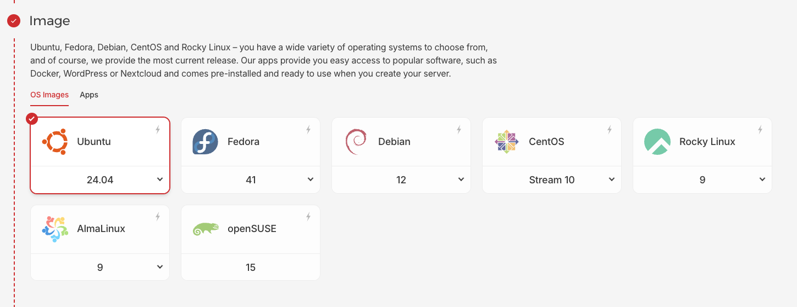
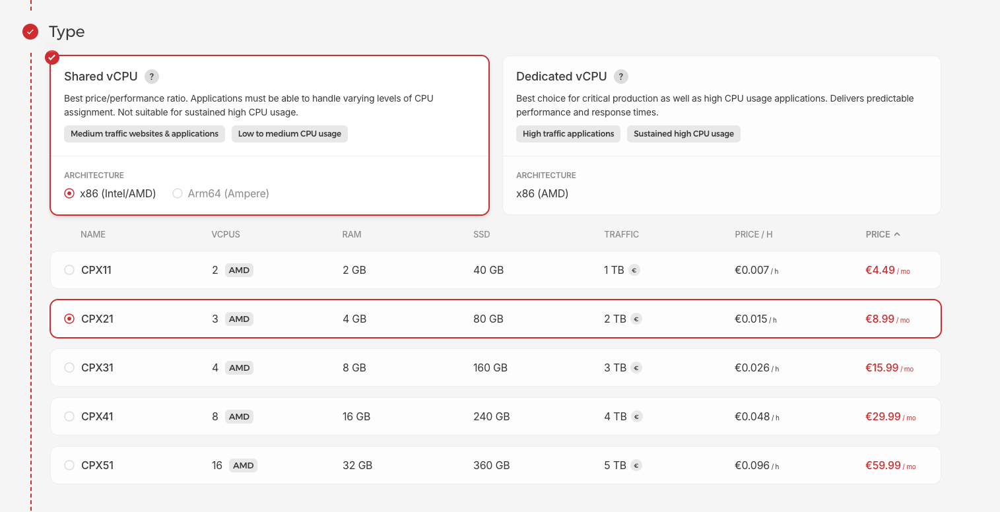
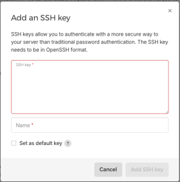
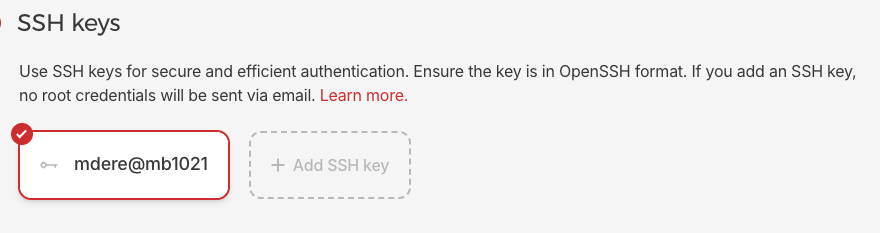
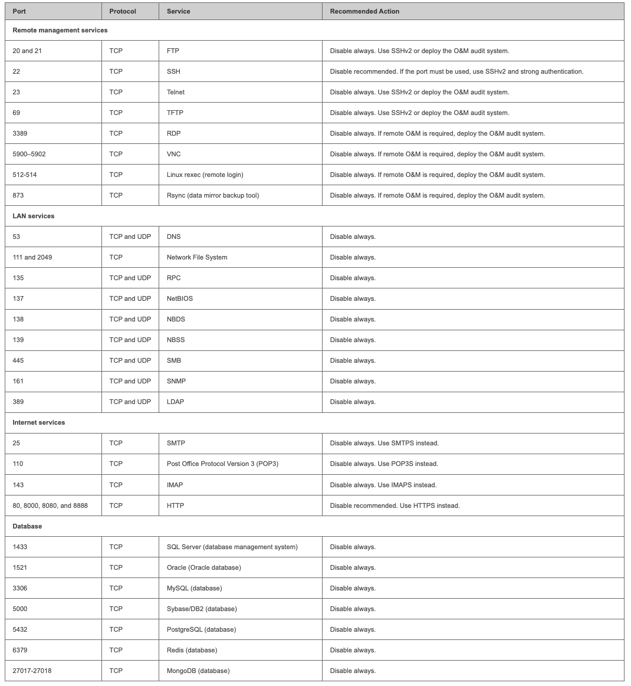
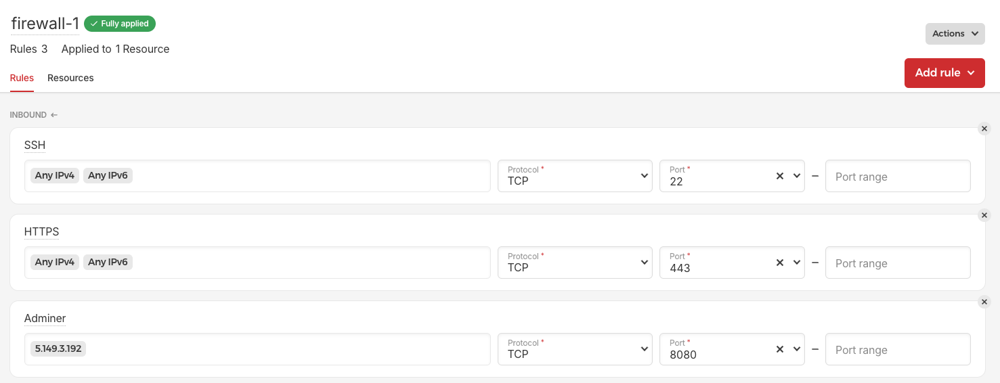

# Hetzner Setup

## Erstellen einer VM:

Ich erstelle eine VM und lasse mein Projekt darauf laufen.

## Image:

Zuerst wähle ich das Image von der VM (Ich habe Ubuntu 24.04 gewählt):



Als nächstes wähle ich ein CPU, ich wähle ein Shared vCPU, da mein Projekt nicht so viel CPU-Leistung benötigt.



## SSH Key

Jetzt erstelle ich einen SSH-Key. Diesen werde ich nachher zum Einloggen benutzen. Ich kann einen erstellen, indem ich diesen Befehl auf meinem Host-Device eingebe:

```
ssh-keygen -t ed25519
```

Dieser Befehl erstellt den privaten und öffentlichen Schlüssel im Ordner Users/<dein-benutzer>/.ssh. Ich habe meine Datei "mde_key1" benannt, und keine Passphrase benutzt, um es zu verschlüsseln.

Ich muss meinen öffentlichen Schlüssel auf dem Server kopieren, damit ich überhaupt mit dem privaten Key einloggen kann. Das kann ich hier machen:



Ich gebe es einen Namen und setze es als "Default Key":



## Volume

In meinem Fall brauche ich keinen zusätzlichen Speicherplatz, die VM hat schon 80 GB und das reicht für mich.

## Firewall

Um die VM sicher zu machen, muss ich einige Ports schliessen. Ich habe da eine Liste von High-Risk Ports gefunden: https://support.huawei.com/enterprise/en/doc/EDOC1100297670, und ich werde sie auf meiner VM auch schliessen:



Weil die VM alle Ports schon schliesst, kann ich nur definieren, welche ich öffnen will:



Ich habe 22 für SSH (Einloggen), 443 für HTTPS (für ncaleague.app) und 8080 für Adminer (Datenbankverwaltungstool - nur meine IP-Adresse) offen gelassen.

---

Jetzt kann ich die VM erstellen und mit der SSH-Verbindung einloggen (also mit meinem privaten Schlüssel):

```
ssh root@<ip-address> -i /your/private/ssh/key
```

## Security

Ich muss noch den Server sichern, damit nicht jeder darauf Zugriff hat.

### Login Security

Ich kann diese drei deaktivieren, um das Login-Security zu verbessern:

- Disable password authentication
- Disable root login
- Disable challenge-response authentication

Um diese zu deaktivieren, kann ich diese Befehle ausführen:

```
cd /etc/ssh
nano sshd_config        //Das ist die Konfigurationsdatei von SSH

//Jetzt suche ich diese Begriffe in der Datei und ändere ihre Werte (Einige sind auskommentiert, man muss also die Hashtags löschen, damit sie funktionieren):

PasswordAuthentication no           //Jetzt kann man nur noch mit dem SSH-Key einloggen
PermitRootLogin no                  //Root-Login ist deaktiviert, man muss zuerst als ein User einloggen, dann User ändern
KbdInteractiveAuthentication no     //Mit dem kann man einloggen, indem man einige "Challenges" macht, z.B. Fragen beantworten. Sollte nicht erlaubt sein.

//Jetzt muss ich die Service neustarten, weil ich einiges geändert habe:

sudo service ssh restart
```

### Second Firewall (ufw)

Es gibt noch eine zweite Firewall, also die Firewall von VM selber. Man kann es mit dem "ufw" (Uncomplicated Firewall) konfigurieren:

```
WICHTIG: Entweder diese Befehle als root ausführen, oder vorne noch "sudo" hinzufügen, sonst funktioniert es nicht!
ufw enable                                      //Service anschalten
ufw allow 22/tcp                                //Port 22 erlauben (SSH)
ufw allow 443/tcp                               //Port 443 erlauben (HTTPS)
ufw allow from <your-ip> to any port 8080       //Port 8080 erlauben nur für eigene IP-Adresse (Adminer)
ufw reload                                      //Service neustarten
```

Die Firewall funktioniert ähnlich wie die von Hetzner, es erlaubt nur die Ports, die ich geöffnet habe, und alles andere ist dann nicht erlaubt.

### Audit

Audit ist ein Tool zur Überwachung und Protokollierung von Systemereignissen. Ich werde es verwenden, um zu schauen, wer was auf dem Server macht. Als default schreibt es kritische Systemereignisse (z.B. Dateizugriffe und Dateiänderungen), Login/Logouts und das Starten/Stoppen von audit selber. Ich werde es installieren und noch eine Regel hinzufügen:

```
sudo apt install auditd -y
sudo systemctl enable auditd --now      //Mit "--now" wird es direkt gestartet, und nicht erst nach einem Reboot
sudo auditctl -w /etc/passwd -p wa      //"/etc/passwd" zur Liste der überwachten Dateien hinzufügen. Diese Datei enthält Informationen über Benutzer und Passwörter. So kann ich sehen, wenn jemand sein Passwort ändert.
```

Diese Logs werden hier gespeichert: "/var/log/audit/audit.log". Ich kann diese Datei mit diesem Befehl anschauen:

```
sudo cat /var/log/audit/audit.log
```

oder mit anderen Befehlen von audit wie z.B. ausearch (wenn ich ein spezifisches Event suche) oder aureport (wenn ich einen zusammenfassenden Bericht brauche).

### Unattended-Upgrades

Dieser Tool wird immer nach Updates suchen und die Apps aktualisieren:

```
sudo apt install unattended-upgrades -y
sudo systemctl enable unattended-upgrades --now
sudo nano /etc/apt/apt.conf.d/20auto-upgrades           //Die Konfigurationsdatei ändern.

//Add this line to the config file:

APT::Periodic::Unattended-Upgrade"1";                   //Ermöglicht unbeaufsichtigte Paketaktualisierungen, insbesondere Sicherheitsupdates. "1" bedeutet, dass es täglich durchgeführt wird.
```

### Fail2Ban

Dieses Tool schaut die Protokolle von SSH und sperrt eine IP-Adresse, wenn mehrere fehlgeschlagene Anmeldeversuche festgestellt werden. Als default wird es eine IP-Adresse erst dann sperren (für zehn Minuten), wenn jemand fünf Mal nicht schafft, einzuloggen. Wenn man mit SSH versucht, einzuloggen, dann hat man nur drei Versuche. Es kann auch eine Mail schicken, wenn jemand gesperrt wird:

```
sudo apt-get install fail2ban -y
sudo systemctl enable fail2ban --now
sudo cp /etc/fail2ban/jail.conf /etc/fail2ban/jail.local        //Die Hauptkonfigurationsdatei wird bei einem Update wahrscheinlich überschrieben. Daher ist es besser, eine Kopie davon zu erstellen und die Änderungen dort vorzunehmen.

sudo apt install sendmail -y                                    //Wird benutzt, um Mails zu schicken.
sudo systemctl enable sendmail --now

//Jetzt muss ich diese Zeilen finden und ändern (in jail.local):

destemail = ncaleague@netcetera.com
sender = fail2ban@ncaleague.app

//Diese Zeile muss ich noch hinzufügen:

action = %(action_mwl)s                                         //Eine Mail wird mit einer Datei im Anhang gesendet, welche alle Informationen enthält.

//Um jemanden zu entsperren:

sudo fail2ban-client set sshd unbanip <ip-address>
```

---

Hetzner Server-Setup ist fertig, es geht aber weiter mit dem "Docker and Caddy Setup" und "Infrastructure Setup".
