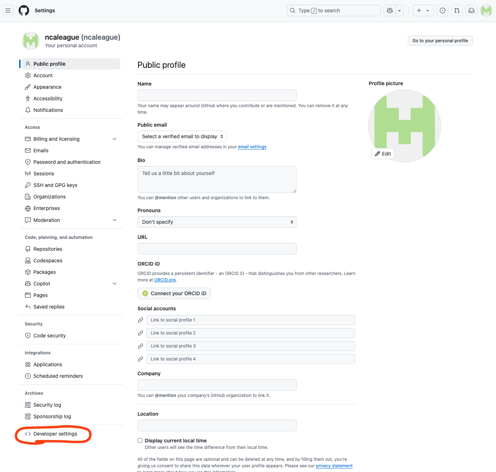
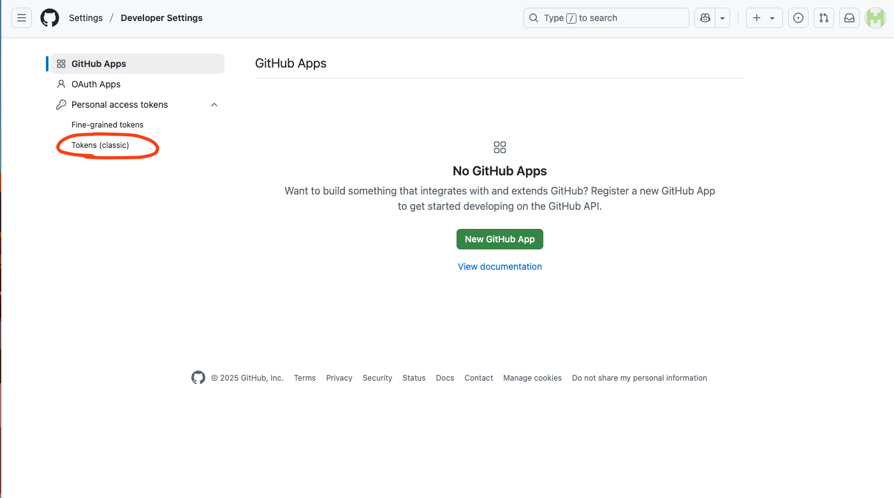
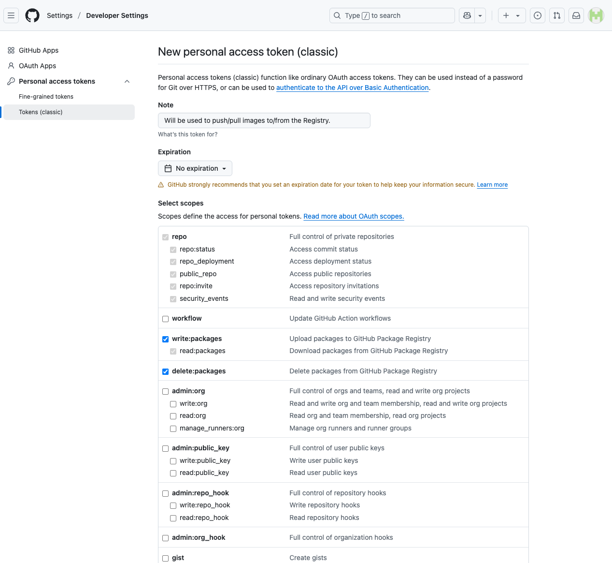
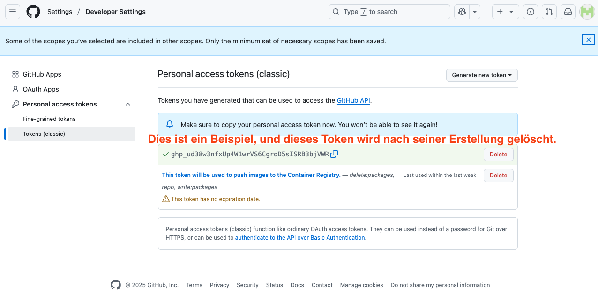

# Infrastructure Setup

Nachdem ich meinen Hetzner Server eingerichtet habe, werde ich Docker Images vom Projekt erstellen, damit ich sie als Container auf dem Server ausführen kann.

---

## GitHub Container Registry für Images

Als erstes brauche ich ein Registry, auf dem ich meine Images pushen kann, und nachher wieder davon pullen kann. Ich erstelle also eines auf Github:

1. Ich erstelle zuerst ein Github Account (Ich überspringe diesen Schritt, da es nicht zu kompliziert ist.), und dann gehe ich zu Einstellungen und wähle die Option "Developer Settings" aus:



2. Ich will jetzt ein Access Token erstellen, damit ich auf meinem Registry Zugriff habe. Dafür wähle ich hier das "classic token" aus:



3. Als "Note" schreibe ich, warum ich dieses Token brauche, damit ich in der Zukunft weiss, warum ich es erstellt habe. Als "Expiration" wähle ich "No expiration". Weil ich nur mit "Packages" (also Images) arbeiten werde, wähle ich alles mit "Packages" aus:



4. Jetzt habe ich ein Token erstellt. Ich muss es aber kopieren und irgendwo speichern, sonst geht es verloren, und ich muss ein neues erstellen:



5. Ich muss nun das Projekt vorbereiten. Das heisst, ich muss einige Konfigurationsdateien und Dockerfiles schreiben, damit ich meine Images bauen kann. Ich habe dafür diese Dateien in diesem Ordnerstruktur erstellt:

```
ncaleague
└─ infrastructure
   └─ docker
      ├─ caddy-central
      │     ├─ Caddyfile
      │     └─ docker-compose.yml
      ├─ dev
      │     ├─ Caddyfile
      │     ├─ Dockerfile_backend
      │     ├─ Dockerfile_frontend
      │     ├─ docker-compose.yml
      │     └─ .env.development
      ├─ prod
      │     ├─ Caddyfile
      │     ├─ Dockerfile_backend
      │     ├─ Dockerfile_frontend
      │     ├─ docker-compose.yml
      │     └─ .env.production
      ├─ watchtower
      │     ├─ docker-compose.yml
      │     └─ .env.watchtower
      └─ entrypoint.sh
```

## Erstellen der Dateien

### Caddyfiles

Ich habe zwei Arten von Caddyfiles in meinem Projekt: ein zentrales Caddyfile für Reverse Proxy, und zwei Caddyfiles für Static File Hosting (Production und Development). Das zentrale Caddyfile definiert "headers", und sorgt dafür zusätzliche Sicherheit im HTTP-Response:

### Caddyfile (central):
```
ncaleague.app {
	handle {
		reverse_proxy ncaleague-frontend:80
	}

	handle /api/* {
		reverse_proxy ncaleague-backend:3000
	}
	
	header {
		Strict-Transport-Security "max-age=31536000; includeSubDomains" // Erzwingt HTTPS für die nächsten 31.536.000 Sekunden (~1 Jahr) und stellt sicher, dass auch alle Subdomains HTTPS verwenden müssen.
        X-Content-Type-Options "nosniff"                                // Verhindert, dass Browser den MIME-Typ des Inhalts „erraten“; stellt sicher, dass Dateien entsprechend ihres deklarierten Content-Types interpretiert werden (z. B. text/html, image/png).
        X-Frame-Options "DENY"                                          // Verhindert, dass die Website in einem <iframe> eingebettet wird, was sogenannte Clickjacking-Angriffe unterbindet.
        Referrer-Policy "no-referrer"                                   // Stellt sicher, dass beim Absenden von HTTP-Anfragen keine Referrer-Informationen mitgeschickt werden. Wenn Nutzer von dieser Seite zu einer anderen wechseln, wird die vorherige URL nicht mitgesendet.
        Content-Security-Policy "frame-ancestors 'none';"               // Ähnlich wie `X-Frame-Options: DENY`, aber moderner und strenger.
	}
}

dev.ncaleague.app {
	handle {
		reverse_proxy ncaleague-frontend-dev:80
	}

	handle /api/* {
		reverse_proxy ncaleague-backend-dev:3000
	}
	
	header {
		Strict-Transport-Security "max-age=31536000; includeSubDomains"
        X-Content-Type-Options "nosniff"
        X-Frame-Options "DENY"
        Referrer-Policy "no-referrer"
        Content-Security-Policy "frame-ancestors 'none';"
	}
}
```

### Caddyfile (dev and prod):
```
:80 {
	handle {
		root * /srv
		file_server
		try_files {path} /index.html
	}
}
```

---

### Docker-Compose Files

Ich habe für jede Umgebung ein Docker-Compose File geschrieben. Diese beinhalten alle Services für Frontend, Backend, Datenbank und Datenbank-Verwaltungstool (Adminer). Die Datenbanken haben ein Healthcheck, und Backends werden nur dann gestartet, wenn die Datenbanken "healthy" sind und laufen. Die Services sind mit einem Netzwerk miteinander verbunden und können mit den Service-Namen kommunizieren (z.B. db-dev und nicht db_dev, db_dev ist der Container-Name). Falls sie aus irgendeinem Fehler stoppen, werden sie neugestartet. Die Datenbanken und die Backends brauchen Umgebungsvariablen für die Datenbankkonfiguration, und diese holen sie von den ".env"-Dateien. Diese Dateien werden wir noch schreiben und auf dem Server kopieren. Die Frontend-Services brauchen noch zusätzlich zwei Volumes, weil Caddy die Daten persistent speichern muss. Falls diese Daten verloren gehen, muss Caddy immer neue Zertifikate (TLS, damit die Webseite sicher ist, also HTTPS) holen, und ab einer Anzahl von Zertifikaten muss man eine lange Weile warten, bevor man wieder Zertifikaten bekommen kann:

### docker-compose.yml (dev):
```
services:
  db-dev:
    image: postgres
    container_name: postgres_dev
    restart: always
    env_file:
      - .env.development
    ports:
      - 5433:5432
    healthcheck:
      test: ["CMD-SHELL", "PGPASSWORD=${POSTGRES_PASSWORD} pg_isready -U ${POSTGRES_USER} -d ${POSTGRES_DB}"]
      interval: 10s
      retries: 5
      start_period: 30s
      timeout: 10s
    networks:
      - ncaleague-network

  adminer-dev:
    image: adminer
    container_name: adminer_dev
    restart: always
    ports:
      - 8081:8080
    networks:
      - ncaleague-network

  ncaleague-backend-dev:
    image: ghcr.io/ncaleague/nca-225-2/ncaleague/ncaleague_backend:latest_dev
    container_name: ncaleague_backend_dev
    depends_on:
      db-dev:
        condition: service_healthy
    expose:
      - 3000
    restart: always
    env_file:
      - .env.development
    networks:
      - ncaleague-network

  ncaleague-frontend-dev:
    expose:
      - 80
      - 443
    image: ghcr.io/ncaleague/nca-225-2/ncaleague/ncaleague_frontend:latest_dev
    container_name: ncaleague_frontend_dev
    restart: always
    networks:
      - ncaleague-network
    volumes:
      - caddy-data:/data
      - caddy-config:/config

networks:
  ncaleague-network:
volumes:
  caddy-data:
  caddy-config:
```

### docker-compose.yml (prod):
```
services:
  db:
    image: postgres
    container_name: postgres
    restart: always
    env_file:
      - .env.production
    ports:
      - 5432:5432
    healthcheck:
      test: ["CMD-SHELL", "PGPASSWORD=${POSTGRES_PASSWORD} pg_isready -U ${POSTGRES_USER} -d ${POSTGRES_DB}"]
      interval: 10s
      retries: 5
      start_period: 30s
      timeout: 10s
    networks:
      - ncaleague-network

  adminer:
    image: adminer
    container_name: adminer
    restart: always
    ports:
      - 8080:8080
    networks:
      - ncaleague-network

  ncaleague-backend:
    image: ghcr.io/ncaleague/nca-225-2/ncaleague/ncaleague_backend:latest
    container_name: ncaleague_backend
    depends_on:
      db:
        condition: service_healthy
    expose:
      - 3000
    restart: always
    env_file:
      - .env.production
    networks:
      - ncaleague-network

  ncaleague-frontend:
    expose:
      - 80
      - 443
    image: ghcr.io/ncaleague/nca-225-2/ncaleague/ncaleague_frontend:latest
    container_name: ncaleague_frontend
    restart: always
    networks:
      - ncaleague-network
    volumes:
      - caddy-data:/data
      - caddy-config:/config

networks:
  ncaleague-network:
volumes:
  caddy-data:
  caddy-config:
```

---

### Docker-Compose for Watchtower

Watchtower schaut immer, ob ein neues Image für einen Container gibt, und aktualisiert den Container, wenn es eine neue Version findet. Man muss dafür die Container-Namen geben, und noch bestimmen, wie oft es überprüfen muss. In meinem Fall, alle 30 Sekunden. Im ".env"-File werden die Login-Daten von Github gespeichert, damit es überhaupt nach neuen Versionen suchen kann:

### docker-compose.yml:
```
services:
  watchtower:
    image: containrrr/watchtower
    container_name: watchtower
    restart: always
    env_file:
      - .env.watchtower
    volumes:
      - /var/run/docker.sock:/var/run/docker.sock
    command: >
      ncaleague_backend
      ncaleague_frontend
      ncaleague_backend_dev
      ncaleague_frontend_dev
      --debug
      --interval 30
```

---

### Entrypoint

Mit diesem Skript werden die Tabellen auf der Datenbank erstellt, und das Backend gestartet:

### entrypoint.sh:
```
#!/bin/bash
echo 'migrate database'
bun run db:migrate
echo 'start server'
bun run serve
```

---

### Environment Variables

Hier sind die Umgebungsvariablen, ich schreibe nur die Keys hier, da man die Values nicht als Klartext auf einem Repository pushen kann. Die Values kann man aber im Projekt finden:

### .env.development and .env.production:
```
POSTGRES_USER
POSTGRES_PASSWORD
POSTGRES_DB
DATABASE_URL
```

### .env.watchtower:
```
REPO_USER
REPO_PASS
WATCHTOWER_CLEANUP
WATCHTOWER_INCLUDE_RESTARTING
WATCHTOWER_INCLUDE_STOPPED
WATCHTOWER_REVIVE_STOPPED
```

---

### Dockerfiles

Ich brauche nur noch die Dockerfiles, damit ich die Images bauen kann:

### Dockerfile_backend (dev):
```
FROM node:alpine
RUN apk --no-cache add ca-certificates wget gcompat bash            //Installiert SSL-Zertifikate, wget (Datei-Download), Bash (Shell) und GNU-Kompatibilität ohne Cache.
RUN apk add --no-cache dos2unix
RUN mkdir -p /opt/bin
COPY ncaleague-backend/ /ncaleague-backend/
COPY infrastructure/docker/entrypoint.sh /opt/bin/entrypoint
RUN dos2unix /opt/bin/entrypoint && chmod +x /opt/bin/entrypoint    //dos2unix ist ein Tool, das Windows-Zeilenumbrüche (\r\n) in Unix-Zeilenumbrüche (\n) umwandelt.
WORKDIR /ncaleague-backend/
RUN npm install -g bun
RUN npm install
RUN bun run build
ENTRYPOINT ["/opt/bin/entrypoint"]
```

### Dockerfile_frontend (dev):
```
FROM docker-registry-mirror.netcetera.com/node:21 AS build
COPY ncaleague-frontend/ /ncaleague-frontend/
WORKDIR /ncaleague-frontend/
RUN npm ci
RUN npm run build

FROM caddy:2-alpine
COPY --from=build /ncaleague-frontend/dist/ /srv
WORKDIR /data
COPY infrastructure/docker/dev/Caddyfile /etc/caddy/Caddyfile   //Kopiert mein Caddyfile auf dem Server.
```

### Dockerfile_backend (prod):
```
FROM node:alpine
RUN apk --no-cache add ca-certificates wget gcompat bash
RUN apk add --no-cache dos2unix
RUN mkdir -p /opt/bin
COPY ncaleague-backend/ /ncaleague-backend/
COPY infrastructure/docker/entrypoint.sh /opt/bin/entrypoint
RUN dos2unix /opt/bin/entrypoint && chmod +x /opt/bin/entrypoint
WORKDIR /ncaleague-backend/
RUN npm install -g bun
RUN npm install
RUN bun run build
ENTRYPOINT ["/opt/bin/entrypoint"]
```

### Dockerfile_frontend (prod):
```
FROM docker-registry-mirror.netcetera.com/node:21 AS build
COPY ncaleague-frontend/ /ncaleague-frontend/
WORKDIR /ncaleague-frontend/
RUN npm ci
RUN npm run build

FROM caddy:2-alpine
COPY --from=build /ncaleague-frontend/dist/ /srv
WORKDIR /data
COPY infrastructure/docker/prod/Caddyfile /etc/caddy/Caddyfile
```

## Bauen der Images

Jetzt kann ich die Images bauen. Ich benutze buildx, weil ich das Plattform noch definieren muss (Plattform vom Server, also linux/amd64):

### Dev backend:
```
docker buildx build --platform linux/amd64 -f Dockerfile_backend -t ghcr.io/ncaleague/nca-225-2/ncaleague/ncaleague_backend:latest_dev .
```

### Dev frontend:
```
docker buildx build --platform linux/amd64 -f Dockerfile_frontend -t ghcr.io/ncaleague/nca-225-2/ncaleague/ncaleague_frontend:latest_dev .
```

### Prod backend:
```
docker buildx build --platform linux/amd64 -f Dockerfile_backend -t ghcr.io/ncaleague/nca-225-2/ncaleague/ncaleague_backend:latest .
```

### Prod frontend:
```
docker buildx build --platform linux/amd64 -f Dockerfile_frontend -t ghcr.io/ncaleague/nca-225-2/ncaleague/ncaleague_frontend:latest .
```

## Pushen der Images

Ich muss nur noch die Images pushen, damit ich sie nachher auf dem Server pullen kann. Ich muss mich aber bei der Registry anmelden (mit dem Github-Username und dem Access Token):

```
echo <access-token> | docker login ghcr.io -u <username> --password-stdin
```

Jetzt kann ich sie mit dem "docker push" pushen:

```
docker push ghcr.io/ncaleague/nca-225-2/ncaleague/ncaleague_backend:latest_dev
docker push ghcr.io/ncaleague/nca-225-2/ncaleague/ncaleague_frontend:latest_dev
docker push ghcr.io/ncaleague/nca-225-2/ncaleague/ncaleague_backend:latest
docker push ghcr.io/ncaleague/nca-225-2/ncaleague/ncaleague_frontend:latest
```

Und fertig! Später kann ich diese Images pullen und verwenden, um Container für mein Projekt zu erstellen. Die Konfigurationsdateien habe ich noch nicht kopiert, das werde ich im Abschnitt „Docker und Caddy Setup“ machen.