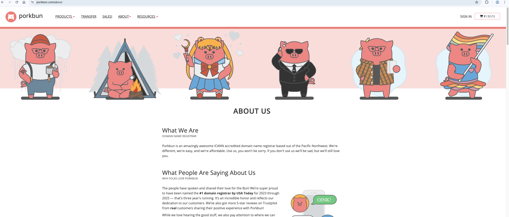
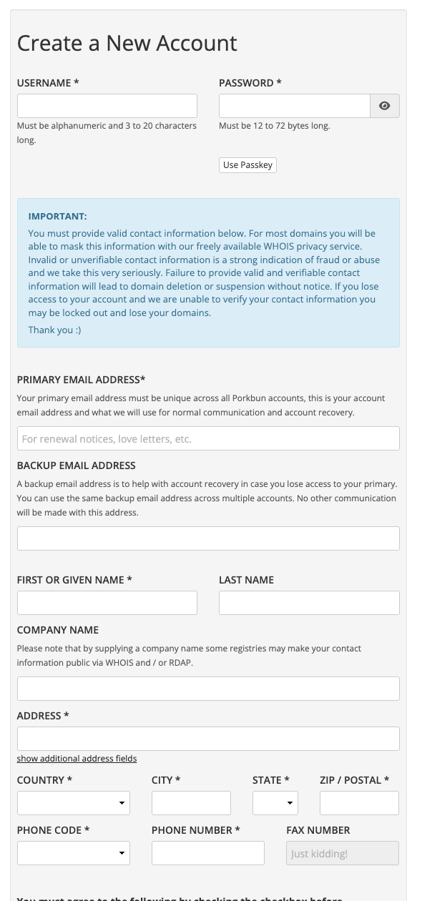
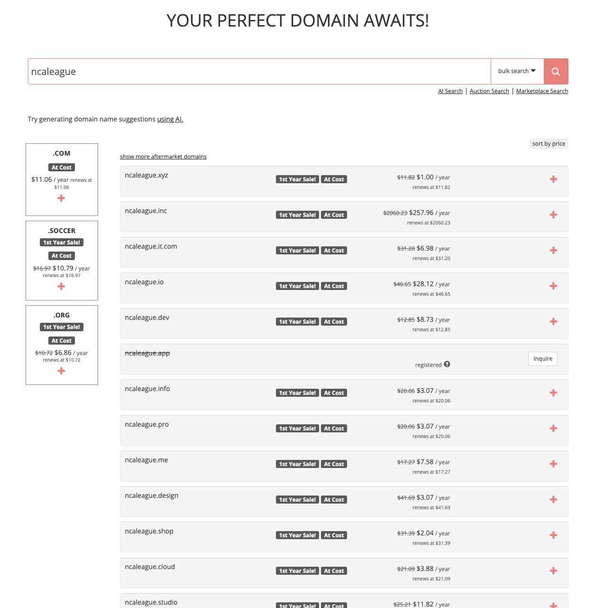
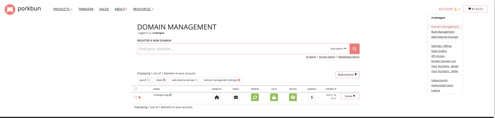
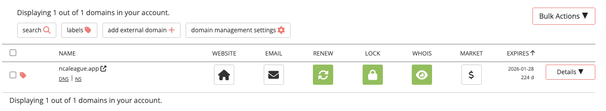
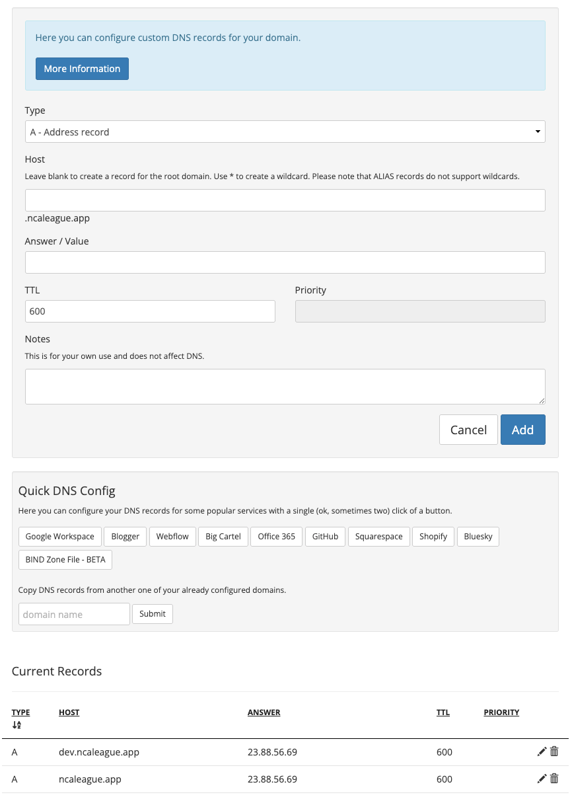
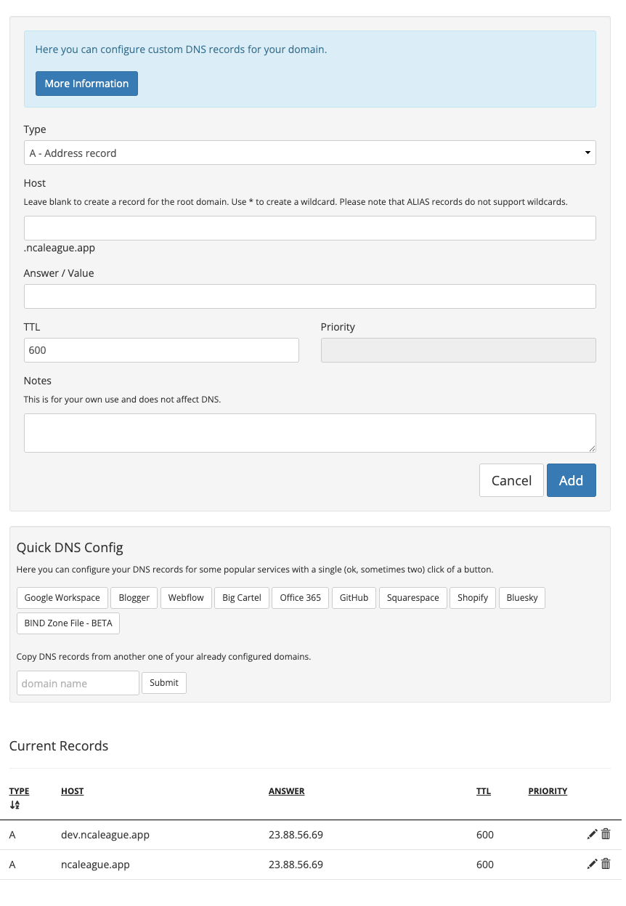

# Server Setup

In dieser Dokumentation werde ich erklären, wie ich einen Server auf Hetzner aufgesetzt habe. Die drei Schritte ("Docker and Caddy", "Hetzner" und "Infrastructure") kannst du im Sidebar finden.

## Domain

Ich brauche für meinen Server ein Domain, weil ich meine Webseite (ncaleague) nicht mit der IP-Adresse aufrufen. Dafür muss ich jetzt ein Domain kaufen. Ich habe dafür Porkbun gefunden: Ein "Domain Name Registrar", also eine Webseite, auf der ich Domains kaufen kann:

### Anmelden

Ich habe dann ein Account auf Porkbun erstellt:

Nachher habe ich mich für ein Domain entschieden. Da die App "ncaleague" heisst, habe ich nach allen Domains mit dem Namen "ncaleague" gesucht:

Hier habe ich einen passenden Domainname gefunden (ncaleague.app), und dann gekauft. Nachher habe ich auf Account>Domain Management geklickt, um mein Domain zu sehen und verwalten:

Ein Domain alleine macht nichts, man muss es konfigurieren. Deshalb klicke ich auf "DNS" unter dem Domainnamen und erstelle ein neues A-Record:

Als Type habe ich "A - Address Record" gewählt. Das ermöglicht eine IP-Adresse mit einem Domain zu "verbinden". Das heisst also, dass ich in der Zukunft im Browser "ncaleague.app" suchen kann, und nicht "23.42.235.123" (Beispiel). Im Host habe ich "dev" geschrieben, damit ich die Development-Umgebung auch mit der gleichen IP-Adresse verbinden kann. Als TTL habe ich 600 gewählt, das heisst, dass der Client beim Aufrufen der Webseite den Domainnamen speichert (im Cache) und dann 600 Sekunden lang (10 Minuten) nicht mehr einen DNS-Server fragt. Das macht dann für 10 Minuten lang die Aufrufe schneller. Die IP-Adresse finde ich erst dann, wenn ich einen Server auf Hetzner erstelle, deshalb muss ich den ersten Schritt im "Hetzner Setup" (also "Erstellen einer VM") noch machen, damit ich die IP-Adresse vom Server hier schreiben kann:

Mein Domain ist jetzt bereit. Die nächste Schritte sind "Hetzner Setup" --> "Infrastructure Setup" --> "Docker and Caddy Setup".